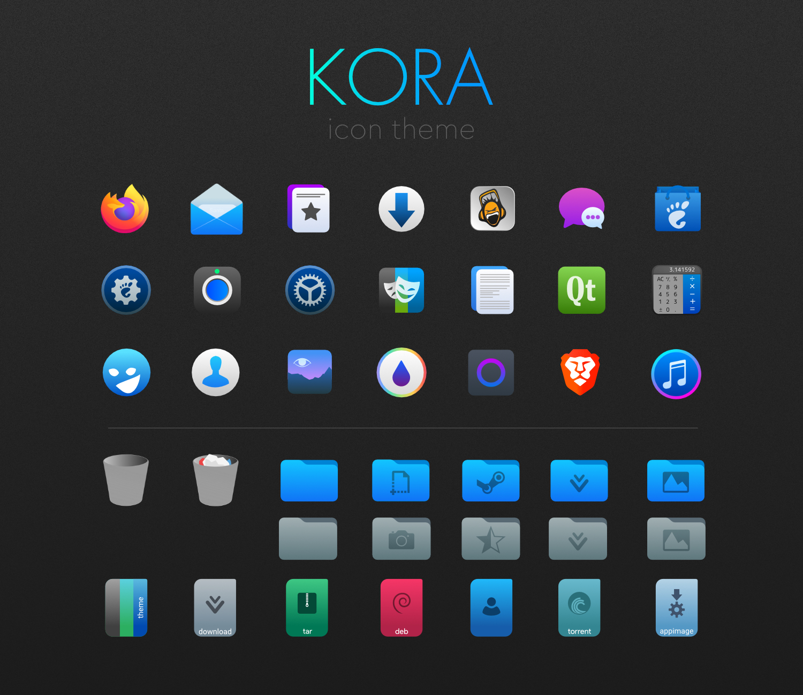

# KORA

**Kora** is an SVG icon theme with lots of new icons and other ones based on *Papirus*. 

To make them display properly, you may need to update the icon cache. A script is included.

Different versions available:
* ***korla*** - for dark themes with dark panel
* ***korla-light*** - for light themes with dark panel (depends on Korla)
* ***korla-light-panel*** - for light themes with light panel (depends on Korla and Korla-light)
* ***korla-pgrey*** - theme with grey folder colors (depends on Korla)

## Installation

Clone this repository on your system
    
    git clone https://github.com/bikass/korla.git

and copy ***korla***, ***korla-light***, ***korla-light-panel*** and ***korla-pgrey*** subfolders to one of the following folders: 

* `/usr/share/icons/` - icons available system-wide
* `$HOME/.local/share/icons/` - icons only available to local user

### Specific Linux distributions

* **Arch Linux**: [stable](https://aur.archlinux.org/packages/korla-icon-theme/) and [git](https://aur.archlinux.org/packages/korla-icon-theme-git/)
* **Solus**: sudo eopkg it korla-icon-theme

## Preview

## License

[GPL3](https://www.gnu.org/licenses/gpl-3.0-standalone.html)
