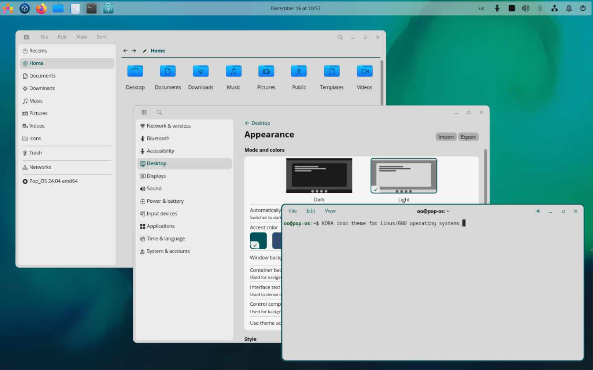

# KORA

**Kora** is an SVG icon theme for GNU/Linux operating systems.

To make them display properly, you may need to update the icon cache. A script is included.

Different versions available:
* ***kora*** - for dark themes with dark panel
* ***kora-pgrey*** - theme with grey folder colors (depends on Kora)

## Installation

Clone this repository on your system

    git clone https://github.com/bikass/kora.git

and copy ***kora*** folder to one of the following folders:

* `/usr/share/icons/` - icons available system-wide
* `$HOME/.local/share/icons/` - icons only available to local user

### Specific Linux distributions

* **Arch**: [stable](https://aur.archlinux.org/packages/kora-icon-theme/)
* **Fedora**: [repository](https://copr.fedorainfracloud.org/coprs/hazel-bunny/ricing/package/kora-icon-theme)
* **openSuse**: [repository](https://build.opensuse.org/package/show/X11:common:Factory/kora-icon-theme)
* **Solus**: sudo eopkg it korla-icon-theme

## Preview

## License

[GPL3](https://www.gnu.org/licenses/gpl-3.0-standalone.html)
