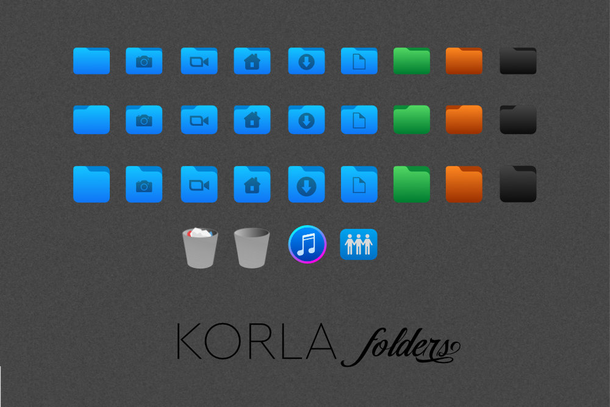

# KORLA

**Korla** icon theme is a mix of the following icon sets: *Korla* and *Papirus*. To make icons display properly, you may need to update the icon cache. A script is included.

This theme is considered to be in beta. Many things need to be cleaned up. Use at your own risk.
If anyone knows how to make it better or fix what is not working, help is appreciated.

## Installation

Clone this repository on your system
    
    git clone https://github.com/bikass/korla.git

and copy both ***korla*** and ***korla-light*** subfolders to one of the following folders: 

* `/usr/share/icons/` - icons available system-wide
* `$HOME/.local/share/icons/` - icons only available to local user

### Specific Linux distributions

* **Arch Linux**: [AUR package](https://aur.archlinux.org/packages/korla-icon-theme/)

## Preview

## Korla folders

Folder icon sets for Korla icon theme. https://github.com/bikass/korla-folders

## Support

Appreciate for coffee or beer:
ko-fi.com/tarmakofi 

## License

[GPL3](https://www.gnu.org/licenses/gpl-3.0-standalone.html)
