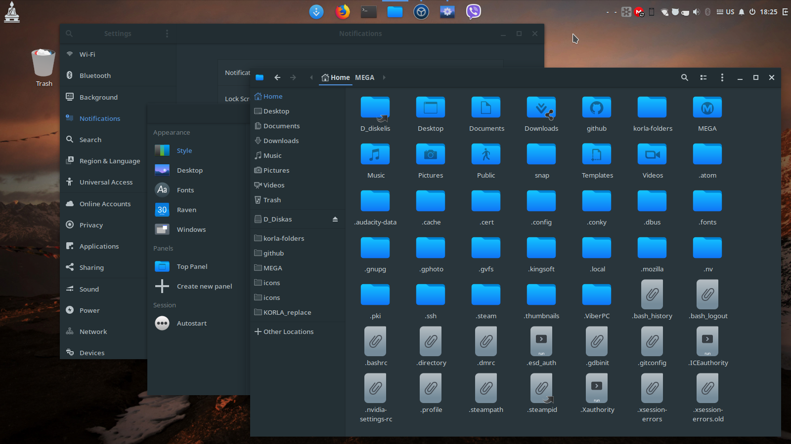
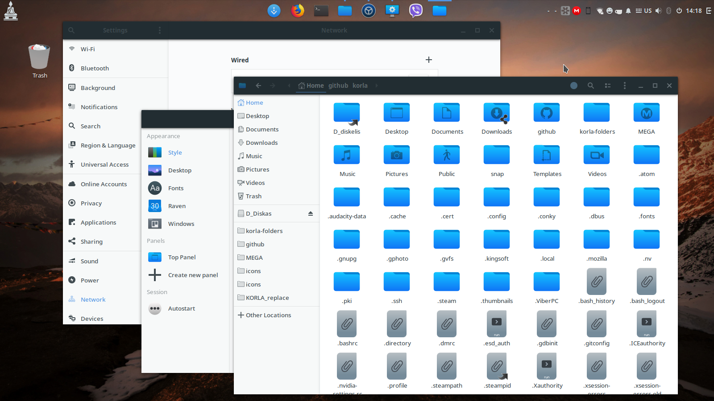

# KORLA

**Korla** icon theme is a mix of the following icon sets: *La Capitaine*, *MacOS11* and *Papirus*. It has also brand new icons, Mac specific have been replaced and dozen others were redone. To make them showing properly, you may need to update the icon cache. A script is included.

This theme is considered to be in beta version. Many things need to be cleaned up. Use at your own risk.
If someone knows how to make it better or fix what it's not working, help is appreciated.

## Installation

Clone this repository on your system
    
    git clone https://github.com/bikass/korla.git

and copy both ***korla*** and ***korla-light*** subfolders to one of the following folders: 

* `/usr/share/icons/` - icons available system-wide
* `$HOME/.local/share/icons/` - icons only available to local user

### Specific Linux distributions

* **Arch Linux**: [AUR package](https://aur.archlinux.org/packages/korla-icon-theme/)

## Preview

## License

[GPL3](https://www.gnu.org/licenses/gpl-3.0-standalone.html)
