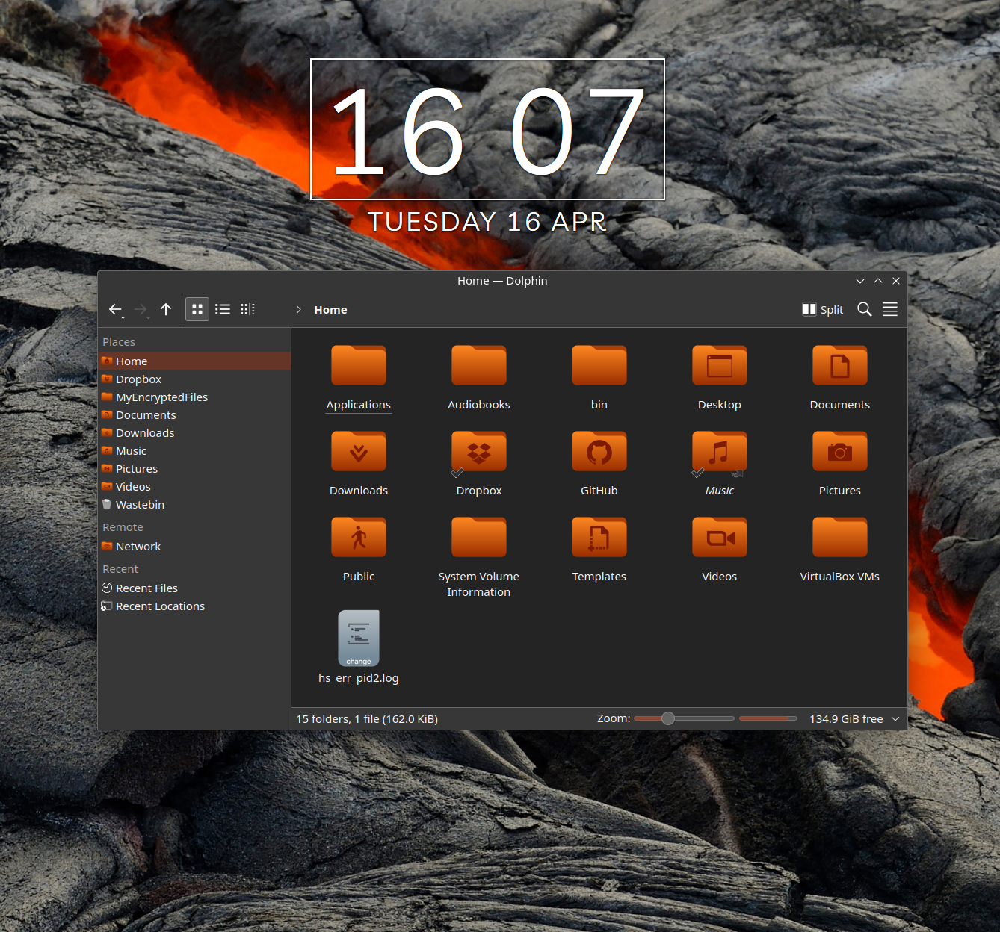

# KORA ORANGE

**Kora Orange** is an SVG icon theme with lots of new icons for GNU/Linux operating systems.

To make them display properly, you may need to update the icon cache. A script is included.

Different versions available:
* ***kora-orange*** - for dark themes with dark panel
* ***kora-orange-light*** - for light themes with dark panel (depends on Kora)
* ***kora-orange-light-panel*** - for light themes with light panel (depends on Kora and Kora-light)

## Installation

1. Download the latest release from https://github.com/zbeeble49/kora/releases
2. Extract all folders from the 'kora-black-x-x-x.tar.gz'package
3. Copy ***kora-orange***, ***kora-orange-light*** and ***kora-orange-light-panel*** subfolders to one of the following folders on your system:

    * `/usr/share/icons/` - icons available system-wide
    * `$HOME/.local/share/icons/` - icons only available to local user

## Preview

## License

[GPL3](https://www.gnu.org/licenses/gpl-3.0-standalone.html)
